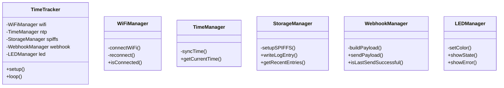
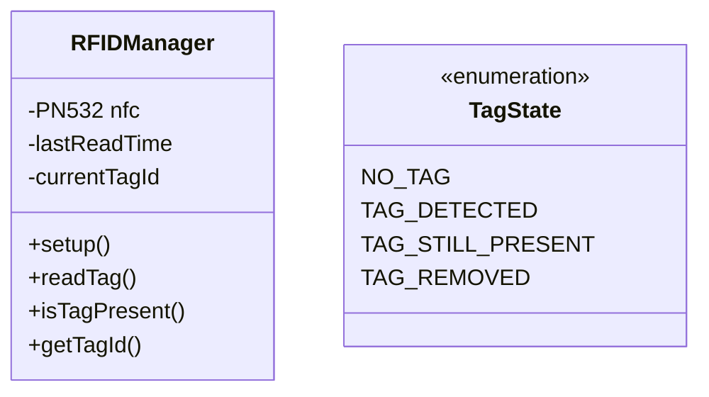
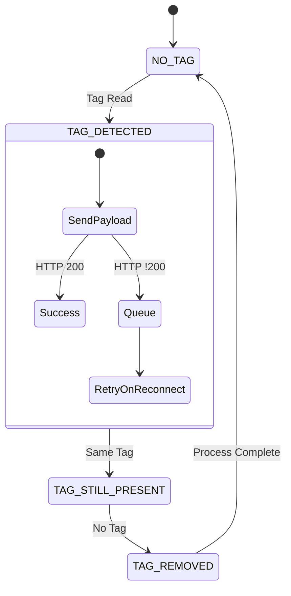

# Time Tracker Project Progress V3

## Core Design Principles

1. FSM (Finite State Machine) as main mechanic for tag states and behaviors
2. Serial print monitoring for feedback and debug
3. Structured and documented code for clear organization
4. Modular functions (input-process-output model)
5. Step-by-step integration with validation checkpoints

## Implementation Phases

### Phase 1: Basic Infrastructure ✅

- [x] Multi SSID connection from credentials.h array
- [x] NTP time sync for internal clock calibration
- [x] Button trigger (GPIO 9) for JSON payload POST
- [x] Basic webhook defined in credentials.h
- [x] Validation: Successful POST with:
  - Device name
  - Internal time
  - Dummy tagID
  - Event type

Validation Results:

- WiFi: Connected successfully
- NTP Time Sync: Working correctly
- Button Trigger: Functioning as expected
- Payload POST: Successfully sending to webhook
- n8n Integration: Successfully mapping JSON fields to Supabase table

### Phase 2: SPIFFS Integration ✅

- [x] Initialize SPIFFS and data structure:
  - Create /data folder
  - Setup log.csv with headers
  - Implement file management functions

- [x] Log Entry Implementation:
  - CSV Structure: timestamp,tag_id,event_type,post_status
  - Maximum 100 entries management
  - Read/Write operations validation

- [x] Enhanced Payload Structure:
  - Keep current webhook functionality
  - Add log_entries array to payload
  - Include last 3 entries for state tracking

Validation Checkpoints:

- [x] SPIFFS mount successful
- [x] log.csv creation/access working
- [x] Entry writing successful
- [x] Log content correctly included in webhook payload

Validation Results:

- SPIFFS: Successfully mounted and operational
- Log Management: Successfully creating and accessing log.csv
- Entry System: Writing entries on button press
- Payload Enhancement: Successfully including last 3 log entries
- All systems integrated and working as expected

Implementation Notes:

- SPIFFS filesystem configured in platformio.ini
- Log management functions implemented (write, read, trim)
- JSON payload enhanced to include recent log entries

### Phase 3: Code Refactoring & RFID Preparation

#### Class Structure Refactoring

#### RFID Integration

Tasks:

- [ ] Refactor existing functionality into dedicated classes
- [ ] Initialize PN532 module and basic communication
- [ ] Implement 1-second read interval
- [ ] Basic tag presence detection
- [ ] LED status implementation for different states

Validation Checkpoints:

- [ ] All refactored classes working as expected
- [ ] PN532 communication established
- [ ] Tag reading at 1-second intervals
- [ ] LED patterns working for all states

### Phase 4: FSM Implementation & Queue Management

#### State Machine Design

Tasks:

- [ ] Implement FSM for tag state management
- [ ] Queue management for failed payloads:
  - Empty reader = break
  - New tag = log + payload + break
  - Existing tag = break
  - Tag removal = log + payload
- [ ] Add post status tracking
- [ ] Implement retry mechanism on WiFi reconnection

Validation Checkpoints:

- [ ] State transitions working correctly
- [ ] Queue system handling failed payloads
- [ ] Retry mechanism working on reconnection
- [ ] All LED states reflecting current status
- [ ] Complete system integration test

## Current Status

Phase 2 completed successfully. Starting Phase 3 with code refactoring and RFID preparation.
