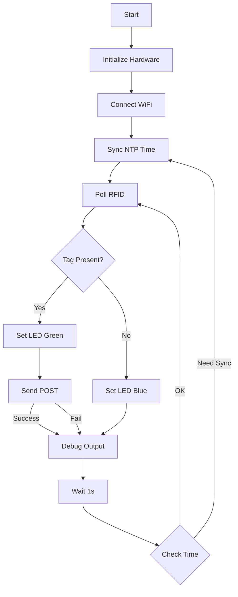

# Time Tracker Project Progress V3

## Core Design Principles

1. Progressive integration with validation between steps
2. Serial print monitoring for feedback and debug
3. Structured and documented code
4. Simple and reliable RFID detection

## Implementation Phases

### Phase 1: RFID Switch Foundation ✅

Starting point: Working RFID switch code from main.cpp

Core Functionality:

- [x] Basic RFID tag detection (success true/false)
- [x] LED feedback (blue=waiting, green=detected)
- [x] Serial debugging output
- [x] 1-second polling interval

Validation Checkpoints:

- [x] Consistent tag detection
- [x] Clear LED state indication
- [x] Proper serial output
- [x] Stable operation over time

Implementation Notes:

- Added tag type detection (Mifare Classic 4-byte, ISO14443-4 7-byte)
- Optimized I2C communication with recovery time
- Enhanced debug output with tag type information
- Improved timing control for stable readings

### Phase 2: WiFi Integration with NTP Time Sync

Building on validated RFID switch:

- [x] WiFi connection with multi-SSID support
- [x] Connection status via LED
- [x] NTP time synchronization
- [x] Basic webhook defined in credentials.h
- [x] Simple POST on tag detection

Validation Checkpoints:

- [x] WiFi connects reliably
- [x] LED shows connection status
- [x] NTP time syncs correctly
- [x] Timestamps in correct timezone
- [x] Webhook receives basic POST
- [x] System remains stable

Implementation Notes:
- Added WiFiManager class for modular WiFi handling
- Implemented NTP sync with timezone support (UTC+1 Brussels)
- Enhanced debug output with timestamps and sync status
- Visual feedback for time sync (purple LED flash)
- Added WebhookManager for handling POST requests
- Implemented JSON payload for RFID events (tag_insert/tag_removed)
- Created Supabase table structure for event logging

### Phase 3: Storage Implementation

After stable network operation:

- [ ] Initialize SPIFFS
- [ ] Create and manage log.csv
- [ ] Log tag events with timestamp
- [ ] Include logs in webhook payload

Validation Checkpoints:

- [ ] SPIFFS mounts properly
- [ ] Logs written correctly
- [ ] File rotation works
- [ ] Payload includes logs

### Phase 4: Enhanced Communication

Once storage is validated:

- [ ] Improved webhook payload structure
- [ ] Failed payload queueing
- [ ] Automatic retry on reconnection
- [ ] Enhanced LED patterns for status

Validation Checkpoints:

- [ ] Payloads sent successfully
- [ ] Queue system works
- [ ] Retries function properly
- [ ] LED patterns are clear

## Current Status

Phase 2 completed ✅, moving to Phase 3:

✅ Completed:
- Implemented reliable RFID detection (Phase 1)
- Added WiFiManager with multi-SSID support
- Integrated NTP time synchronization
- Enhanced debug output with timestamps
- Validated WiFi connection and time sync
- Implemented webhook functionality with JSON payload
- Created Supabase database structure
- Validated webhook POST requests for tag events

🔄 Next Phase (Storage Implementation):
- Initialize SPIFFS
- Implement local logging
- Add file rotation mechanism
- Enhance webhook payload with log data

Next steps:
- Begin SPIFFS implementation
- Create log file structure
- Implement file operations
